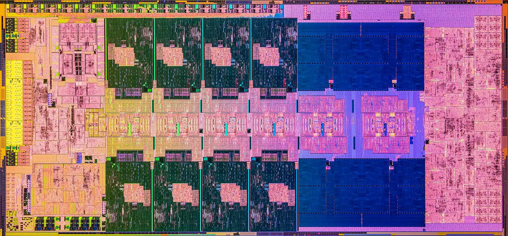

# 现代x86 CPU微架构：以Intel Core系列为例

2008年，Intel推出了基于Nehalem架构的i系列处理器，自此Core i3/5/7成为市场上独霸十余年的主导力量。下图是第一代45nm制程的Nehalem架构的裸片影相（die shot），其面积为263 mm²，拥有7亿3千余个晶体管，由四个核心组成。

<figure><figcaption>
Nehalem Die Shot 
</figcaption></figure>

时至今日，Intel Core i系列CPU已经迭代至第十三代Raptor Lake架构（见下图），其采用10nm的Intel 7制程，同时具有8个P核（大核，高性能高功耗）与16个E核（小核，低性能低功耗）。

<figure><figcaption>
Raptor Lake die shot
</figcaption></figure>

CPU的发展离不开微架构的升级和迭代，这也是性能以及能效比进步的关键。以i7系列为例，虽然各代基础结构相似，但通过改变缓存策略、增加内存带宽、扩展指令发射数量、提升分支预测性能等优化，在世代更迭之间逐步提升了其性能。早期的i7微架构使用保留站（reservation station）和重排序缓冲区（reorder buffer）来实现乱序执行。在随后的架构中（从6代i7开始），寄存器重命名（register renaming）技术得到了应用，使得性能得到了进一步的提高。

升级和优化使得x86的性能逐步提升，然而，从一个比较宽泛的角度来讲，x86架构自其出现的四十余年中，并未出现较大的变革，其原始设计（包括几乎所有原始指令集）都可以在现代x86 CPU中找到。例如，最初的 8086 处理器有 14 个 CPU 寄存器，至今仍在使用：四个通用寄存器：AX、BX、CX 和 DX；四个段寄存器：代码段 (CS)、数据段 (DS)、额外段 (ES) 和堆栈段 (SS)；四个指向不同内存位置的索引寄存器——源索引 (SI)、目标索引 (DI)、基址指针 (BP) 和堆栈指针 (SP)与一个状态寄存器。最后，还有最重要的寄存器：指令指针 (IP)。正确调用这些寄存器的汇编程序，在如今的任何一颗x86 CPU中，都可以被正确执行。正是这种良好的向下兼容性，使得x86备受广大厂商和用户青睐。

<figure><figcaption>
Intel 8086 die shot
</figcaption></figure>

下面是8086内部结构的抽象示意图，结合上下两张图可以看出，相比如今的CPU结构，Intel 8086的内部结构则显得非常简单。

<figure><figcaption>
Intel 8086 内部结构示意图
</figcaption></figure>

在上文中出现的术语可能会让一些读者感到陌生，但请不用担心，在接下来的篇幅中，我们将以最简洁明了的语言为您描绘现代CPU微架构的蓝图。如果您曾修读过《计算机体系结构》课程，请回忆起其中关于“流水线”概念的内容，并着重思考它。因为本书所需掌握的架构知识基本都围绕着“流水线”展开。
